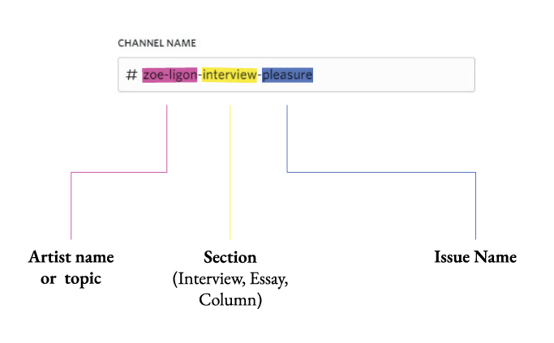
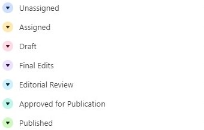
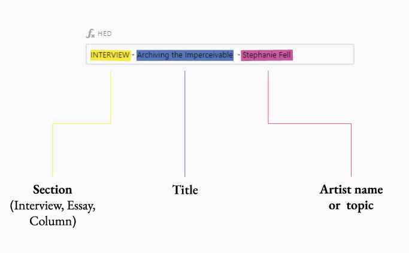

import { Callout } from 'nextra-theme-docs'

# Writing for the Quarterly

This section will guide you through the editorial process with Opera Quarterly from start to finish.

#### What you’ll need:
- Airtable
- Discord
- Google Drive

#### 1. Signing Up
We’ve created an editorial calendar for potential story ideas. [Please sign up here](https://airtable.com/shrGcRNBybQe4cUFJ) to start the process and make working with you as seamless as possible.
Once you fill out this form you will receive an invitation via email to the Discord server. Follow along the prompts to create an account if you don’t have one already. If you already have a Discord account then it should be pretty easy. Once in the server, confirm you have the “FQ Contributor” role assigned to yourself.

#### 2a. Finding unassigned stories
Our Editorial agenda is kept mostly on Airtable through the link below. There, you’ll see which stories are unassigned.
This Airtable Board
Only stories that are unassigned will be listed there. Once you show interest in a story...

**i. Claim on Discord**

Reply to the Discord message that corresponds to the story you want to claim. “I would like to be considered for x” will do.
When the AUTHOR receives approval from _EIC_ or _MANAGING EDITOR_ (normally with a green checkbox), the AUTHOR can get started on the assignment.

**ii. Accepted: Assign on Airtable**

Once you’ve claimed an article and gotten the MANAGING EDITOR’S approval, they will then assign the article to you on Airtable (using the email you provided in the sign up form), thus removing it from the board.

#### 2b. Pitching a story
 
<Callout type="warning" emoji="⚠️">
  WORK IN PROGRESS. We have a page describing our pitching process on the Fameless Quarterly website at the moment. We will migrate that here in the near future.
</Callout>

#### 3. How to collaborate with Fameless Editorial team on stories
Once you’ve been assigned an article on Airtable a new Discord channel will be created to prep and discuss anything having to do with your article.
The name of the channel will differ but will follow this template:

All writers, contributors and supporters have access to these channels. Do not be afraid to crowdsource questions to ask the ARTIST.
These are the stages a typical article goes through:

What do they mean?
- `Assigned` -- AUTHOR has work to do
- `Draft` -- MANAGING EDITOR has work to do
- `Final Edits` -- AUTHOR has work to do
- `Editorial Review` -- Editor in Chief has work to do
- `Approved for Publication` -- MANAGING EDITOR has work to do
- `Published` -- Editorial work is done. Article is then marketed.

#### 3.1 Start
AUTHOR goes on to write the article. If it’s an interview, here are some tips on interviewing artists. Make sure you do your research beforehand if you interview the artist over a video conference or a phone.

The AUTHOR is then responsible for reaching out to the artist to schedule an interview (email template is provided).

_Interviews_ are then done in whatever is most convenient for the artist (via email, phone, Skype, etc.).

Once you’ve written the first draft of your article, follow the steps below:

**a. AUTHOR shares Google Doc with brianf@famelessmag.com**

To save time, [ensure your Doc is formatted properly](https://docs.google.com/document/d/1wdpPiC6rBM24D-YikfQ6f4fdelPnC1bGxLAU9ntMfeI/edit?usp=sharing).

Naming the Document appropriately also helps streamline the process, although sometime the tile of the story will come to us during the editing process. You can grab the file name from the Airtable. See example below:

Once MANAGING EDITOR receives first draft, they change the status in Airtable from “Assigned” to “Draft”
The article goes through two rounds of edits.

**b. FQ EDITORIAL edits article**

MANAGING EDITOR makes first edit to the article.
The MANAGING EDITOR will copy the original version and paste it above to create a new version.
The MANAGING EDITOR will edit the new version of the article. That leaves us with a fresh copy of the article to edit and the history of the article below it. Looking back at the original gives us context, and is always helpful.
- MANAGING EDITOR: Structural editing
    - Restructuring, changing order of paragraphs, merging and deleting sentences, etc.
    - Clarifying and consolidating key concepts.
    - Identifying areas that need more depth.
    - Checking accuracy.
The MANAGING EDITOR then finalizes their edits by adding their initials to the beginning of the file name and posting an update to the Discord channel to signal the AUTHOR that the article is ready for them. Finally, the MANAGING EDITOR changes the status on Airtable from “Draft” to “Final Edits”

**c. AUTHOR makes revisions**

**AUTHOR** makes revisions to the article according to the EDITOR’S feedback.

Once **AUTHOR** makes revisions to the article, they ping the EIC. That can be on email, or Discord.

**AUTHOR** gather’s visuals >

**AUTHOR** asks the ARTIST for visuals for the article. If there's an opportunity to photograph the artist then AUTHOR reaches out to Brian to schedule an opportunity.

If someone from Fameless is photographing them then the AUTHOR’S work is finished at this point.

Otherwise, the **AUTHOR** must forward the assets to the editorial team. A sure fire way of doing that is emailing them to hello@famelessmag.com. Other ways of sending include: Discord, Dropbox, WeTransfer, attaching to Airtable or Google Drive.

Once **AUTHOR** sends, they should follow up with the receiver until they get confirmation.

_Remember: Sent does not mean received. Ask for confirmation._

**d. Final draft approved by EIC**

- EDITOR IN CHIEF: Copy editing
    - Checking the details.
    - Minor restructuring and rewriting.
    - Consistency of tense, terminology, abbreviations, etc.
    - Facts and reference checking.
    - Style checking.

MANAGING EDITOR proofreads article >

**e. MANAGING EDITOR inputs in to WEBFLOW**

The MANAGING EDITOR put’s the article in Webflow making sure all required fields are complete.

**Title:** Approved title (should be in GDoc)

**Intro Text:** Intro made in collaboration with the **AUTHOR** (should be in GDoc). This has to be a minimum of 140 characters and a maximum of 280 characters.

**Post Content:** The article itself (In GDoc)

**Issue:** Marked in Airtable (in the `Issue` column).

**Category:** Marked in Airtable (in the `Section` column).

**Medium:** Marked in Airtable (in the `Genre` column), AUTHOR should confirm with ARTIST.

**Author:** Author should have already provided necessary information via the sign up link on this page. Here it is again.

**f. BRIAN revises for Art Direction and gives final approval >**

- BRIAN (EIC) then shares the staged link with **AUTHOR**
    - **AUTHOR** then confirms media with the **ARTIST**.
    - Final changes (if approved) are then made along with collection of media by the **AUTHOR**.

**g. MANAGING EDITOR schedule article to go live**

Airtable is updated

Story goes live

#### 4. Publishing and promotion

#### Send it.

* "`positive-adjective` to share my latest piece in Opera Quarterly! I delve into `subject-matter-of-story`. `link-to-story`"
* "Just had my essay published in Opera Quarterly! In it, I explore `subject-matter-of-story`. `link-to-story`"
* "Thrilled to be a part of the latest issue of The Quarterly with my column on the future of the creative industry."
* "Proud to have one of my audio companions featured in The Quarterly's latest issue. Listen along with the stories!"
* "Honored to have my story chosen as the cover of The Quarterly's latest issue. Check it out to learn more about the world of creativity. #CoverStory"

Feel free to sprinkle some emojis in there. The more the better.

`THE LETTER`